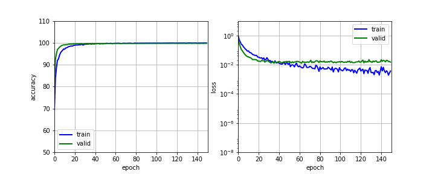

# Traffic Sign Classification

## Project goal and description

The goal of the project is to train a deep neural nework for Traffic Sign Recognition. Steps taken in this project include:

* Explore, summarize and visualize the data set
* Design, train and test a model architecture
* Use the model to make predictions on new images
* Analyze the softmax probabilities of the new images

---
## Explore, summarize and visualize the data set
Statistics of the traffic signs data set are as follows:

* The size of training set is 34799
* The size of the validation set is 4410
* The size of test set is 12630
* The shape of a traffic sign image is (32, 32, 3)
* The number of unique classes/labels in the data set is 43 

From visualization section (In[6]) in Traffic_Sign_Claasifier_submit.html, we notice that the original data are very biased, data for speed limit 50km/h has 2010 samples while data for speed limit 20km/h has only 180 samples. It's also worth noting that quality of the raw data varies drastically for the same traffic sign. Therefore, preprocessing of the raw data is frist performed. Data is first preprocessed via a pipline that sequentially perfomrs gamma correction, image sharpening and histogram equalization. As an example shown in Out[11] in Traffic_Sign_Claasifier_submit.html, image features are more clearly demonstaretd after preprocessing. To amend the bias issue, preprocessed images are then augmented via rotation for the cases with few data points. As illustrated in Out[16], after augmentation, number of images per class are roughly on the same order of magnitude. 

---
## Design, train and test a model architecture

My final model consisted of the following layers and the architecture is partially adopted from the paper "Multi-Column Deep Neural Network for Traffic Sign
Classification" :

| Layer         		|     Description	        					| 
|:---------------------:|:---------------------------------------------:| 
| Input         		| 32x32x3 RGB image   							| 
| Convolution 5x5     	| 1x1 stride, valid padding, outputs 28x28x100 	|
| RELU					|												|
| Max pooling	      	| 2x2 stride,  outputs 14x14x100 				|
| Convolution 3x3	    | 1x1 stride, valid padding, outputs 12x12x150 	|
| RELU					|												|
| Max pooling	      	| 2x2 stride,  outputs 6x6x150  				|
| Flatten				| outputs 1x5400        						|
| Fully connected		| outputs 1x300, dropout 0.5					|
| RELU					|												|
| Fully connected		| outputs 1x43									|
| Softmax				|												|
 
 To train the model, I used the following hyperparameters:
* epochs = 150
* batch size = 180
* learning rate = 0.0005
* initial weight is randomly assigned with zero mean and standard deviation of 0.01
 
The model os trained using AdamOptimizer to minimize the loss fuction, which is defined as cross entropy of the prediction. 

My final model results are:
* training set accuracy of 99.9%
* validation set accuracy of 99.8%
* test set accuracy of 96.8%

Throughout the training procedure, I made the following iterations primarily on hyperparmter tuning:
* In my first attempt, I used a training rate of 0.001 and obtained a test accuracy of 94.8%. However, validation error converges really fast but is more than an order of magnitude larger than that of the training error and it starts to increase after roughly 80 epochs. This indicates that the training rate might be too high and that the model is overfitting the data.

* Therefore, in my second iteration, I decreased the training rate to 0.0005 and test accuracy is increased to 95.4%.

* Lastly, I added a dropout rate of 0.5 in the first fully connected layer to solve the problem of overfitting. And the accuracy and loss vs epoch plot are shown as below:

---
## Test the model performance to make predictions on new images

I used in total 38 new images prepared by navoshta from https://github.com/navoshta/traffic-signs/tree/master/traffic-signs-data/custom. The accuracy on the new images is 88.6% which means out of 38 images, the model accuractely predicts roughly images. As shown by the results of the top 5 softmax probabilities, except the ones that are not in the traing data, the model is able to predict the right sign with probablity equals to 1 for most of the cases. However, thare are also cases where for instance, for case 28, End of all speed and passing limits, the model predicts it to be Speed limit 30km/h with probablity equal to 1. This is primarily because the sign is different from the training images.

## Potential improvements 

